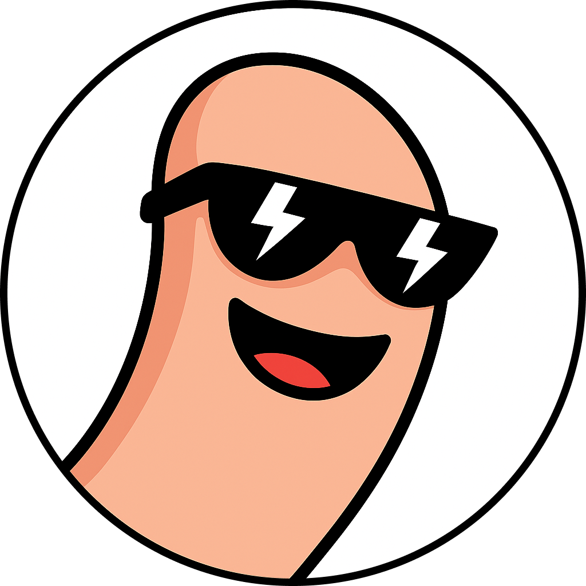

<h1 style="margin-top: 25px" align="center">
    Hey!  What's up?
</h1>

    I'm <a href="https://fingertips18.github.io">Fingertips</a>!

    

    
    
    
    

    

    <h3 valign="center"> 
        
        Welcome to my GitHub
        
    </h3>
    <table>
        <tr>
            <td> Currently working on</td>
            <td><strong>AI related projects</strong></td>
        </tr>
        <tr>
            <td> Learning</td>
            <td><strong>DevOps</strong></td>
        </tr>
        <tr>
            <td> Ask me about</td>
            <td><strong>Software Development</strong></td>
        </tr>
        <tr>
            <td> Find my work</td>
            <td><a href="https://github.com/fingertips18">Github</a> & <strong>Bitbucket</strong></td>
        </tr>
        <tr>
            <td> Reach me</td>
            <td><a href="mailto:developer.ghiantan@gmail.com">developer.ghiantan@gmail.com</a></td>
        </tr>
        <tr>
            <td> Fun fact</td>
            <td><strong>I talk to dumbbells regularly</strong> 💪</td>
        </tr>
    </table>

 

    
    

 

    

<h2 align="center">
    Code  Cycle 
</h2>
 

    
    
    
    
    

   

    
     
    Feel free to <strong>Contact</strong>, <strong>Connect</strong>, and <strong>Collaborate</strong>.
     
    <i>Ghian Tan <a href="https://fingertips18.github.io">@fingertips</a></i>

